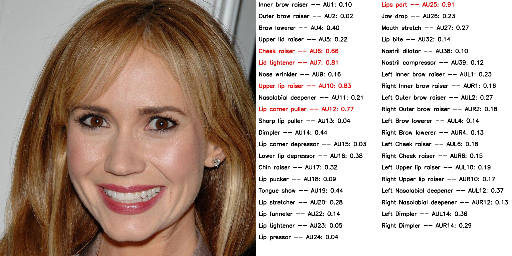

# OpenGrpahAU


This repo is the OpenGprahAU tool.


41 action unit categories, 

| AU1 | AU2 | AU4 | AU5 | AU6 | AU7 | AU9 |   AU10 | AU11  | AU12 | AU13 | AU14 | AU15 | AU16 | 
| :---:  | :---: | :---: | :---: | :---: | :---: | :---: | :---: | :---: | :---: | :---: | :---: | :---: | :---: |
| Inner brow raiser| Outer brow raiser | Brow lowerer  | Upper lid raiser  | Cheek raiser | Lid tightener | Nose wrinkler | Upper lip raiser | Nasolabial deepener | Lip corner puller | Sharp lip puller | Dimpler | Lip corner depressor | Lower lip depressor |
| AU17 | AU18 | AU19 | AU20 | AU22 | AU23 | AU24 |   AU25 | AU26  | AU27 | AU32 | AU38 | AU39 | - | 
| :---:  | :---: | :---: | :---: | :---: | :---: | :---: | :---: | :---: | :---: | :---: | :---: | :---: | :---: |
| Chin raiser | Lip pucker | Tongue show | Lip stretcher  | Lip funneler | Lip tightener | Lip pressor | Lips part | Jaw drop | Mouth stretch | Lip bite | Nostril dilator | Nostril compressor | - |
| AUL1 | AUL1 | AUL2 | AUR2 | AUL4 | AUR4 | AUL6 |   AUR6 | AUL10  | AUR10 | AUL12 | AUR12 | AUL14 | AUR14 | 
| :---:  | :---: | :---: | :---: | :---: | :---: | :---: | :---: | :---: | :---: | :---: | :---: | :---: | :---: |
| Left inner brow raiser | Right inner brow raiser | Left outer brow raiser | Right outer brow raiser| Left brow lowerer | Right brow lowerer | Left cheek raiser | Right cheek raiser | Left upper lip raiser | Right upper lip raiser | Left nasolabial deepener | Right nasolabial deepener | Left dimpler | Right dimpler |

traiend on hybrid dataset of 2,000k images.

demo:
<p align="center">

</p>


## Pretrained models

Hybrid Dataset

### Stage1:

|arch_type|GoogleDrive link| Average F1-score|
| :--- | :---: |  :---: |
|`Ours (ResNet-18)`| -| - |
|`Ours (ResNet-50)`| [link](https://drive.google.com/file/d/11xh9r2e4qCpWEtQ-ptJGWut_TQ0_AmSp/view?usp=share_link) | - |
|`Ours (ResNet-101)`| - | -  |
|`Ours (Swin-Tiny)`| - | - |
|`Ours (Swin-Small)`| - | - |
|`Ours (Swin-Base)`| - | - |


### Stage2:

|arch_type|GoogleDrive link| Average F1-score|
| :--- | :---: |  :---: |
|`Ours (ResNet-18)`| -| - |
|`Ours (ResNet-50)`| - | - |
|`Ours (ResNet-101)`| - | -  |
|`Ours (Swin-Tiny)`| - | - |
|`Ours (Swin-Small)`| - | - |
|`Ours (Swin-Base)`| - | - |


## Demo
- to detect facial action units in an image, run:
```
python demo.py --arc resnet50 --exp-name demo --resume checkpoints/OpenGprahAU-resent50.pth --input demo_imgs/1014.jpg
```
