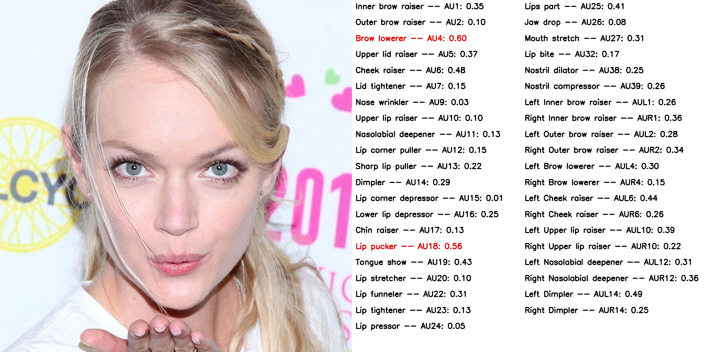
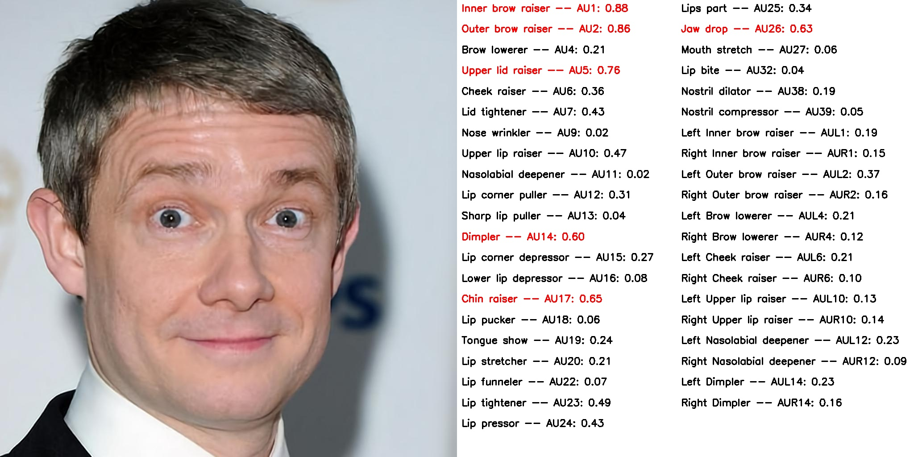
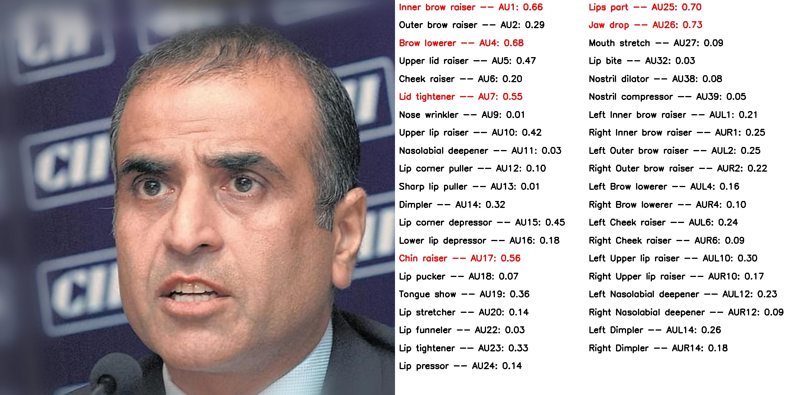
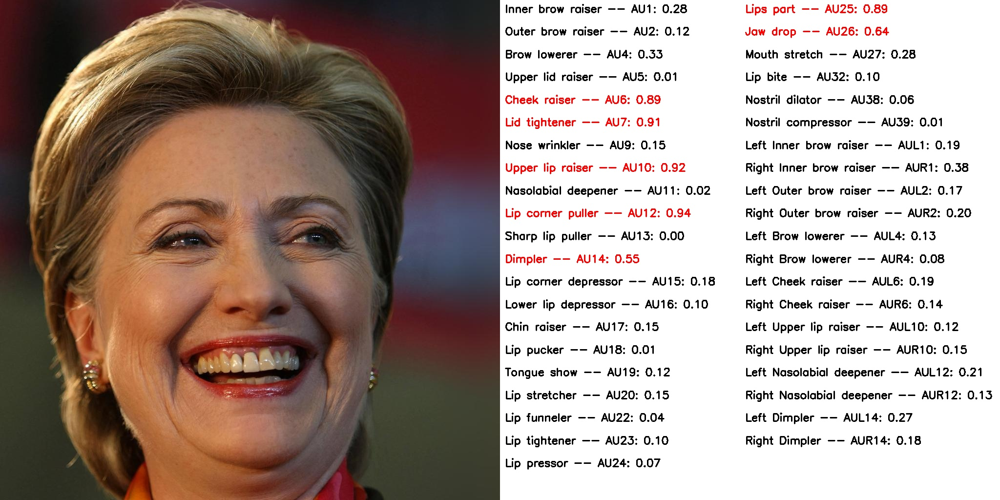

# OpenGrpahAU


This repo is the OpenGprahAU tool.

demo:
<p align="center">
  
  
  
  

</p>

Models were traiend on hybrid dataset of 2,000k images.

This hybrid dataset includes:
 * [BP4D](http://www.cs.binghamton.edu/~lijun/Research/3DFE/3DFE_Analysis.html)
 * [DISFA](http://mohammadmahoor.com/disfa-contact-form/)
 * [RAF-AU](http://www.whdeng.cn/RAF/model3.html)
 * [AFF-Wild 2](https://ibug.doc.ic.ac.uk/resources/aff-wild2/)
 * [CK+](http://www.jeffcohn.net/Resources/)
 * [CASME II](http://casme.psych.ac.cn/casme/e2)


The tool can predict action units of 41 categories:

| AU1 | AU2 | AU4 | AU5 | AU6 | AU7 | AU9 |   AU10 | AU11  | AU12 | AU13 | AU14 | AU15 | AU16 | 
| :-----:  | :-----: | :-----: | :-----: | :-----: | :-----: | :-----: | :-----: | :-----: | :-----: | :-----: | :-----: | :-----: | :-----: |
| Inner brow raiser| Outer brow raiser | Brow lowerer  | Upper lid raiser  | Cheek raiser | Lid tightener | Nose wrinkler | Upper lip raiser | Nasolabial deepener | Lip corner puller | Sharp lip puller | Dimpler | Lip corner depressor | Lower lip depressor |

| AU17 | AU18 | AU19 | AU20 | AU22 | AU23 | AU24 |   AU25 | AU26  | AU27 | AU32 | AU38 | AU39 | - | 
| :-----:  | :-----: | :-----: | :-----: | :-----: | :-----: | :-----: | :-----: | :-----: | :-----: | :-----: | :-----: | :-----: | :-----: |
| Chin raiser | Lip pucker | Tongue show | Lip stretcher  | Lip funneler | Lip tightener | Lip pressor | Lips part | Jaw drop | Mouth stretch | Lip bite | Nostril dilator | Nostril compressor | - |

| AUL1 | AUL1 | AUL2 | AUR2 | AUL4 | AUR4 | AUL6 |   AUR6 | AUL10  | AUR10 | AUL12 | AUR12 | AUL14 | AUR14 | 
| :-----:  | :-----: | :-----: | :-----: | :-----: | :-----: | :-----: | :-----: | :-----: | :-----: | :-----: | :-----: | :-----: | :-----: |
| Left inner brow raiser | Right inner brow raiser | Left outer brow raiser | Right outer brow raiser| Left brow lowerer | Right brow lowerer | Left cheek raiser | Right cheek raiser | Left upper lip raiser | Right upper lip raiser | Left nasolabial deepener | Right nasolabial deepener | Left dimpler | Right dimpler |


We provide tools for prepareing data in ```tool/```.
After Downloading raw data files, you can use these tools to process them, aligning with our protocals.
We divide the dataset into three independent parts (i.e., train, val, test).

## Pretrained models

Hybrid Dataset

### Stage1:

|arch_type|GoogleDrive link| Average F1-score| Average Acc.|
| :--- | :---: |  :---: |  :---: | 
|`Ours (MobileNetV3)`| -| - |  - |
|`Ours (ResNet-18)`| [link](https://drive.google.com/file/d/1b9yrKF663K9IwY2C2-1SD6azpAdNgBm7/view?usp=share_link) | 22.33 |  92.97 |
|`Ours (ResNet-50)`| [link](https://drive.google.com/file/d/11xh9r2e4qCpWEtQ-ptJGWut_TQ0_AmSp/view?usp=share_link) | 22.52 |  92.63 |
|`Ours (Swin-Tiny)`| [link](https://drive.google.com/file/d/1JSa-ft965qXJlVGvnoMepbkRkSm78_to/view?usp=share_link) | 22.66 | 92.97 |
|`Ours (Swin-Small)`| [link](https://drive.google.com/file/d/1GNjFKpd00nvgYIP2q7AzRSzfzEUfAqfT/view?usp=share_link) | 24.49 | 92.84 |
|`Ours (Swin-Base)`| [link](https://drive.google.com/file/d/1nWwowmq4pQn1ACnSOOeyBy6-n0rmqTQ9/view?usp=share_link) | 23.53 | 92.91 |


### Stage2:

|arch_type|GoogleDrive link| Average F1-score| Average Acc.|
| :--- | :---: |  :---: | :---: |
|`Ours (MobileNetV3)`| -| - |  - |
|`Ours (ResNet-18)`| -| - | - |
|`Ours (ResNet-50)`| - | - | - |
|`Ours (Swin-Tiny)`| - | - | - |
|`Ours (Swin-Small)`| - | - | - |
|`Ours (Swin-Base)`| - | - | - |


## Demo
- to detect facial action units in an image, run:
```
python demo.py --arc resnet50 --exp-name demo --resume checkpoints/OpenGprahAU-ResNet50_first_stage.pth --input demo_imgs/1014.jpg
```

## Training and Testing

- to train the first stage of our approach (ResNet-50) on hybrid Dataset, run:
```
python train_stage1.py --arc resnet50 --exp-name OpenGprahAU-ResNet50_first_stage -b 512 -lr 0.00002  
```


- to test the first stage of our approach (SwinT) on hybrid Dataset, run:
```
python test.py --arc swin_transformer_tiny --exp-name test_OpenGprahAU-ResNet50_first_stage  --resume checkpoints/OpenGprahAU-SwinT_first_stage.pth --draw_text
```
