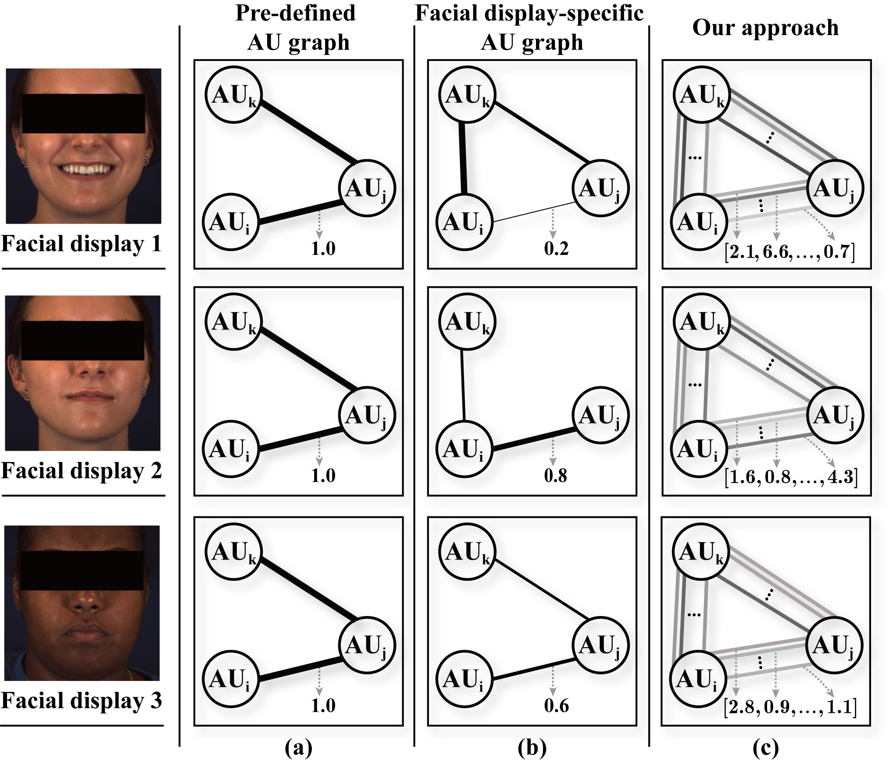

Learning Multi-dimensional Edge Feature-based AU Relation Graph for Facial Action Unit Recognition
=
This is an official release of the paper  
> 
> **"Learning Multi-dimensional Edge Feature-based AU Relation Graph for Facial Action Unit Recognition"**, 
> **IJCAI-ECAI 2022**
> 
> [[Paper]](https://arxiv.org/abs/2205.01782) [[Project]](https://www.chengluo.cc/projects/ME-AU/)
> 
> __Abstract:__ The activations of Facial Action Units (AUs) mutually influence one another. While the relationship between a pair of AUs can be complex and unique, existing approaches fail to specifically and explicitly represent such cues for each pair of AUs in each facial display. This paper proposes an AU relationship modelling approach that deep learns a unique graph to explicitly describe the relationship between each pair of AUs of the target facial display. Our approach first encodes each AU's activation status and its association with other AUs into a node feature. Then, it learns a pair of multi-dimensional edge features to describe multiple task-specific relationship cues between each pair of AUs. During both node and edge feature learning, our approach also considers the influence of the unique facial display on AUs' relationship by taking the full face representation as an input. Experimental results on BP4D and DISFA datasets show that both node and edge feature learning modules provide large performance improvements for CNN and transformer-based backbones, with our best systems achieving the state-of-the-art AU recognition results. Our approach not only has a strong capability in modelling relationship cues for AU recognition but also can be easily incorporated into various backbones.

> - it encodes both the activation status of the AU and its association with other AUs into each node feature
> -  it learns a multi-dimensional edge feature to explicitly capture the task-specific relation

<p align="center">

</p>

>The main novelty of the proposed approach in comparison to pre-defined AU graphs and deep learned facial display-specific graphs are illustrated in this figure.


https://www.chengluo.cc/projects/ME-AU/images/demo.mp4
 

Requirements
=
- Python 3
- PyTorch


- Check the required python packages in `requirements.txt`.
```
pip install -r requirements.txt
```

Data and Data Prepareing Tools
=
The Datasets we used:
  * [BP4D](http://www.cs.binghamton.edu/~lijun/Research/3DFE/3DFE_Analysis.html)
  * [DISFA](http://mohammadmahoor.com/disfa-contact-form/)

We provide tools for prepareing data in ```tool/```.
After Downloading raw data files, you can use these tools to process them, aligning with our protocals.
More details has described in [tool/README.md](tool/README.md).


**Training with ImageNet pre-trained models**

Make sure that you download the ImageNet pre-trained models to `checkpoints/` (or you alter the checkpoint path setting in `models/resnet.py` or `models/swin_transformer.py`)

The download links of pre-trained models are in `checkpoints/checkpoints.txt`

Thanks to the offical Pytorch and [Swin Transformer](https://github.com/microsoft/Swin-Transformer)

Training and Testing
=
- to train the first stage of our approach (ResNet-50) on BP4D Dataset, run:
```
python train_stage1.py --dataset BP4D --arc resnet50 --exp-name resnet50_first_stage -b 64 -lr 0.0001 --fold 1 
```

- to train the second stage of our approach (ResNet-50) on BP4D Dataset, run:
```
python train_stage2.py --dataset BP4D --arc resnet50 --exp-name resnet50_second_stage  --resume results/resnet50_first_stage/bs_64_seed_0_lr_0.0001/xxxx_fold1.pth --fold 1 --lam 0.05
```

- to train the first stage of our approach (Swin-B) on DISFA Dataset, run:
```
python train_stage1.py --dataset DISFA --arc swin_transformer_base --exp-name swin_transformer_base_first_stage -b 64 -lr 0.0001 --fold 2
```

- to train the second stage of our approach (Swin-B) on DISFA Dataset, run:
```
python train_stage2.py --dataset DISFA --arc swin_transformer_base --exp-name swin_transformer_base_second_stage  --resume results/swin_transformer_base_first_stage/bs_64_seed_0_lr_0.0001/xxxx_fold2.pth -b 64 -lr 0.000001 --fold 2 --lam 0.01 
```

- to test the performance on DISFA Dataset, run:
```
python test.py --dataset DISFA --arc swin_transformer_base --exp-name test_fold2  --resume results/swin_transformer_base_second_stage/bs_64_seed_0_lr_0.000001/xxxx_fold2.pth --fold 2
```


### Pretrained models

BP4D
|arch_type|GoogleDrive link| Average F1-score|
| :--- | :---: |  :---: |
|`Ours (ResNet-18)`| -| - |
|`Ours (ResNet-50)`| [link](https://drive.google.com/file/d/1gYVHRjIj6ounxtTdXMje4WNHFMfCTVF9/view?usp=sharing) | 64.7 |
|`Ours (ResNet-101)`| [link](https://drive.google.com/file/d/1i-ra0dtoEhwIep6goZ55PvEgwE3kecbl/view?usp=sharing) | 64.8 |
|`Ours (Swin-Tiny)`| [link](https://drive.google.com/file/d/1BT4n7_5Wr6bGxHWVf3WrT7uBT0Zg9B5c/view?usp=sharing)| 65.6 |
|`Ours (Swin-Small)`| [link](https://drive.google.com/file/d/1EiQd6q7x1bEO6JBLi3s2y5348EuVdP3L/view?usp=sharing) | 65.1 |
|`Ours (Swin-Base)`|[link](https://drive.google.com/file/d/1Ti0auMA5o94toJfszuHoMlSlWUumm9L8/view?usp=sharing)| 65.5 |

DISFA
|arch_type|GoogleDrive link| Average F1-score|
| :--- | :---: |  :---: |
|`Ours (ResNet-18)`| -| - |
|`Ours (ResNet-50)`| [link](https://drive.google.com/file/d/1V-imbmhg-OgcP2d9SETT5iswNtCA0f8_/view?usp=sharing) | 63.1 |
|`Ours (ResNet-101)`| -| - |
|`Ours (Swin-Tiny)`| -| - |
|`Ours (Swin-Small)`| -| - |
|`Ours (Swin-Base)`| [link](https://drive.google.com/file/d/1T44KPDaUhi4J_C-fWa6RxXNkY3yoDwIi/view?usp=sharing) | 62.4 |

Download these files (e.g. ```ME-GraphAU_swin_base_BP4D.zip```) and unzip them, each of which involves the checkpoints of three folds.

Main Results
=
**BP4D**

|   Method  | AU1 | AU2 | AU4 | AU6 | AU7 | AU10 | AU12 | AU14 | AU15 | AU17 | AU23 | AU24 | Avg. |
| :-------: | :---: | :---: | :---: | :---: | :---: | :---: | :---: | :---: | :---: | :---: | :---: | :---: | :---: |
|   EAC-Net  | 39.0 | 35.2 | 48.6 | 76.1 | 72.9 | 81.9 | 86.2 | 58.8 | 37.5 | 59.1 |  35.9 | 35.8 | 55.9 |
|   JAA-Net  |  47.2 | 44.0 |54.9 |77.5 |74.6 |84.0 |86.9 |61.9 |43.6 |60.3 |42.7 |41.9 |60.0|
|   LP-Net |  43.4  | 38.0  | 54.2  | 77.1  | 76.7  | 83.8  | 87.2  |63.3  |45.3  |60.5  |48.1  |54.2  |61.0|
|   ARL | 45.8 |39.8 |55.1 |75.7 |77.2 |82.3 |86.6 |58.8 |47.6 |62.1 |47.4 |55.4 |61.1|
|   SEV-Net | 58.2 |50.4 |58.3 |81.9 |73.9 |87.8 |87.5 |61.6 |52.6 |62.2 |44.6 |47.6 |63.9|
|   FAUDT | 51.7 |49.3 |61.0 |77.8 |79.5 |82.9 |86.3 |67.6 |51.9 |63.0 |43.7 |56.3 |64.2 |
|   SRERL | 46.9 |45.3 |55.6 |77.1 |78.4 |83.5 |87.6 |63.9 |52.2 |63.9  |47.1 |53.3 |62.9 |
|   UGN-B | 54.2  |46.4  |56.8  |76.2  |76.7  |82.4  |86.1  |64.7  |51.2  |63.1  |48.5  |53.6  |63.3 |
|   HMP-PS | 53.1 |46.1 |56.0 |76.5 |76.9 |82.1 |86.4 |64.8 |51.5 |63.0 |49.9 | 54.5  |63.4 |
|   Ours (ResNet-50) | 53.7 |46.9 |59.0 |78.5 |80.0 |84.4 |87.8 |67.3 |52.5 |63.2 |50.6 |52.4 |64.7 |
|   Ours (Swin-B) | 52.7 |44.3 |60.9 |79.9 |80.1| 85.3 |89.2| 69.4| 55.4| 64.4| 49.8 |55.1 |65.5|

**DISFA**

|   Method  | AU1 | AU2 | AU4 | AU6 | AU9 | AU12 | AU25 | AU26 | Avg. |
| :-------: | :---: | :---: | :---: | :---: | :---: | :---: | :---: | :---: | :---: |
|   EAC-Net  |41.5 |26.4 |66.4 |50.7 |80.5 |89.3| 88.9 |15.6 |48.5 |
|   JAA-Net  | 43.7 |46.2 |56.0 |41.4 |44.7 |69.6 |88.3 |58.4 |56.0|
|   LP-Net |  29.9 |24.7 |72.7 |46.8 |49.6 |72.9 |93.8 |65.0 |56.9|
|   ARL | 43.9 |42.1 |63.6 |41.8 |40.0 |76.2 |95.2| 66.8 |58.7|
|   SEV-Net | 55.3 |53.1|61.5 |53.6 |38.2 |71.6 |95.7| 41.5 |58.8|
|   FAUDT | 46.1 |48.6| 72.8 |56.7 |50.0 |72.1 |90.8 |55.4 |61.5 |
|   SRERL | 45.7  |47.8  |59.6  |47.1  |45.6  |73.5  |84.3  |43.6  |55.9 |
|   UGN-B |43.3  |48.1  |63.4  |49.5  |48.2  |72.9  |90.8  |59.0  |60.0 |
|   HMP-PS | 38.0 |45.9 |65.2 |50.9 |50.8 |76.0 |93.3 |67.6 |61.0|
|   Ours (ResNet-50) | 54.6 |47.1 |72.9 |54.0 |55.7 |76.7 |91.1 |53.0 |63.1|
|   Ours (Swin-B) | 52.5 |45.7 |76.1 |51.8 |46.5 |76.1 |92.9 |57.6 |62.4|


Citation
=
if the code or method help you in the research, please cite the following paper:
```
@article{luo2022learning,
title = {Learning Multi-dimensional Edge Feature-based AU Relation Graph for Facial Action Unit Recognition},
author = {Luo, Cheng and Song, Siyang and Xie, Weicheng and Shen, Linlin and Gunes, Hatice},
journal={arXiv preprint arXiv:2205.01782},
year={2022}
}

@inproceedings{luo2022learning,
title = {Learning Multi-dimensional Edge Feature-based AU Relation Graph for Facial Action Unit Recognition},
author = {Luo, Cheng and Song, Siyang and Xie, Weicheng and Shen, Linlin and Gunes, Hatice},
booktitle={Proceedings of the International Conference on Artificial Intelligence (IJCAI)},
year={2022}
}
```
